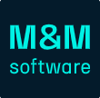
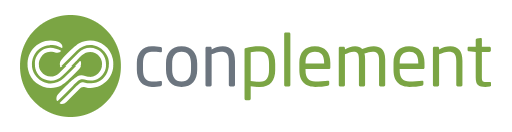
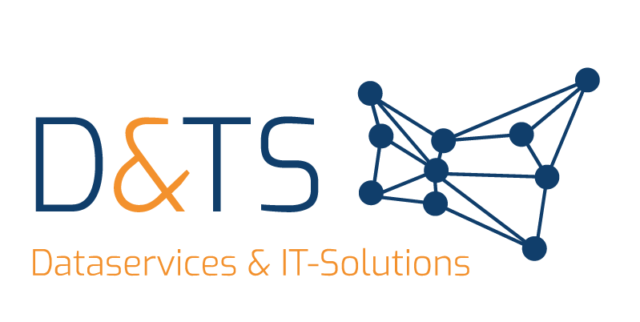

    

        <h2 class="section-heading text-uppercase">Interoperabilität in der Produktion der Zukunft:  1. AAS Summit Österreich</h2>

        Vom digitalen Produktpass über Predictive Maintenance bis zur digitalen Betriebsanleitung: die Asset Administration Shell (AAS) ist die Basis für effiziente Digitalisierung in der Produktion und im Maschinenbau.   

        Der AAS Summit liefert an 1 1/2 Tagen einen Überblick über die Möglichkeiten, die die Asset Administration Shell (AAS) schon heute bietet, um die interoperable Produktion von Morgen zu ermöglichen. Neben Live-Demos in der LIT Factory wird es Vorträge von führenden Expert:innen und Hands-On Workshops geben.  

        <a class="btn mt-4 align-self-center d-flex align-items-center" href="/forms/aas_summit_registration" style="background:#28a745!important; color:white; width:50%"><i class="fa fa-solid fa-arrow-right pr-3"></i>Zur Registrierung   </a><b>Anmeldeschluss: 28. Februar!</b>
         
         
    

    

        
    

  

    
    

        <h5 class="text-left">Veranstalter</h5>
        Das Event wird organisiert von <b><a href="https:twin-tech.at">TwinTech</a></b> und der <b><a href="https://openindustry4.com/">Open Industry 4.0 Alliance</a></b>, mit der Unterstützung der <b><a href="https://www.jku.at/lit-factory/">LIT Factory</a></b>, des <b><a href="https://www.lcm.at/">Linz Center of Mechatronics</a></b>, und des <b><a href="https://www.biz-up.at/cluster-kooperationen/mechatronik-cluster">Mechatronik-Clusters</a></b>.
    

   
    

        <h5 class="text-center">Sponsoren</h5>
        
        
        
    

    

          
        <h2>Von Industrieberichten über Hands-On Workshops</h2>
        Was erwartet dich beim 1. AAS Summit?
          
    

    

<h5>Tag 1 (25. März) @ LIT Factory Linz</h5>
Die LIT Factory zeigt, wie Datenräume und die AAS in der Praxis zusammenspielen - anhand konkreter Use Cases aus dem AMIDS (Austrian Manufacturing Innovation DataSpace). Neben der Vorstellung der Use Cases und des AMIDS Datenraums gibt es auch Demonstrationen an den Maschinen vor Ort.  
 

<h5>Was erwartet dich?</h5>
<i>14:45 - 15:00 Uhr: Get-Together + Anmeldung</i> 
<b>15:00 - 16:30 Uhr: Vorträge AAS + Datenräume</b>
<ul>
<li>Begrüßung und Keynote (TBA)</li>
<li>Vorstellung der Open-Source AAS.TwinEngine</li>
<li>Datenraum AMIDS</li>
<li>Teilnahmemöglichkeiten am Datenraum AMIDS</li>
</ul>
<b>16:30 - 16:50 Uhr: Kaffee und Netzwerken</b>  
<b>16:50 - 18:00 Uhr: Use Case Demonstrationen</b>
<ul>
<li>Use Case I: Co-Design und Co-Development</li>
<li>Use Case II: Datenaustausch entlang der Wertschöpfungskette (Demos in LIT Factory)</li>
</ul>
<b>19:00 - 23:00: Gemeinsames Abendessen</b> Wir reservieren einen Tisch für alle Teilnehmer:innen des AAS Summits in der "Grünen Papaya" (ca. 5 Minuten Fußweg von der LIT Factory). Das Essen ist von allen Teilnehmer:innen selbst zu bezahlen.  

<h5>Tag 2 (26. März) @ Linz Center of Mechatronics</h5>
Der zweite Tag startet mit einer Reihe an Vorträgen, die zeigen, welche Möglichkeiten sich heute schon durch die Interoperabilität in der Produktion mit der AAS ergeben. Am Nachmittag erarbeiten Teilnehmer:innen in 3 parallelen Workshops selbst erste Ergebnisse im Rahmen der AAS. 
 
<h5>Was erwartet dich?</h5>
<i>08:30 - 09:00 Uhr: Get-Together + Anmeldung</i> 
<b>09:00 - 10:30 Uhr: Was ist heute schon möglich mit der AAS?</b>
<ul>
<li>Begrüßung</li>
<li>Keynote von Ruth Markut-Kohl (Engel) und Thomas Sievers (Uhlmann) über die Anwendung der AAS in der Praxis</li>
<li>Use Cases mit dem ClassCOCKPIT und der twinsphere suite</li>
</ul>
<b>10:30 - 11:00 Uhr: Kaffee und Netzwerken</b>  

<b>11:00 - 12:30 Uhr: Datendurchgängigkeit mit der AAS</b>
<ul>
<li>Collaborative Engineering mit der AAS (Markus Kiele-Dunsche, Twindustrial, ehem. Lenze)</li>
<li>DPP - Aktueller Stand und Umsetzung mit der AAS (Andreas Herbst - Plattform Industrie 4.0)</li>
<li>Vom System-Design zum lauffähigen digitalen Zwilling (Thomas Gross - Linz Center of Mechatronics)</li>
<li>Vom Design-Modell zum Zwilling: Das AAS Exporter Plugin des Enterprise Architect (Philippe Barbie - Fraunhofer IESE) </li>
</ul>

<b>13:00 - 14:00 Uhr: Mittagessen und Netzwerken</b>  
<b>14:00 - 16:00 Uhr: Parallele Workshops</b>
<ul>
<li>Workshop 1 - AAS Potenzialanalyse im Lebenszyklus einer Maschine (Christian Methe - Twindustrial)</li>
<li>Workshop 2 - Stragegieworkshop End-to-End Prozess für den DPP (Stefan Huffer - MetaLevel)</li>
<li>Workshop 3 - In 2 Stunden zum intelligenten Geschäftsprozess: die AAS macht's möglich (Rüdiger Fritz - Open Industry 4.0 Alliance)</li>
</ul>
<b>16:00 - 16:30 Wrap-Up</b> 

  

Pictures Credit: JKU  

<h2>Teilnahmegebühr</h2>
<i>Hinweis: alle Preisangaben exkl. USt.</i> 
<ul>
<li><b>Regulärer Preis für beide Tage: € 250</b> </li>
<li>Sonderpreis für Mitglieder des Mechatronik-Clusters oder der Plattform Industrie 4.0 € 200 </li>
<li>Teilnahme für Mitglieder der Open Industry 4.0 Alliance kostenlos </li>
</ul>
<b>Anmeldeschluss: 28. Februar 2026</b>

<a class="btn mt-4 align-self-center d-flex align-items-center" href="/forms/aas_summit_registration" style="background:#28a745!important;max-width: 50%;color:white"><i class="fa fa-solid fa-arrow-right pr-3"></i>Jetzt registrieren (Plätze sind begrenzt)</a>

  

<h5>Anreise</h5>
Option 1: Anreise mit dem Auto
<ul>
<li>Adresse: Altenberger Strasse 69, 4040 Linz</li>
<li>Am und rund um den Campus befinden sich kostenlose und kostenpflichtige Parkplätze (bitte Parkordnung beachten)</li>
</ul>

Option 2: Anreise mit dem Zug
<ul>
<li>Der Bahnhof Linz Hauptbahnhof liegt auf der Hauptverkehrstrecke (Weststrecke) mit 5 Verbindungen/Stunde Richtung Salzburg oder Wien und ist ca. 1 Stunde vom Grenzbahnhof Passau entfernt.</li>
<li>Vom Bahnhof Linz fahren die Straßenbahnen 1 und 2 in ca. 30 Minuten direkt zum Veranstaltungsort (Station Johannes Kepler Universität). Alternativ gibt es auch Optionen mit Bus oder Taxi mit ca. 20 Minuten Fahrtzeit.</li>
</ul>

Option 3: Anreise via Flug
<ul>
<li>Vom Flughafen Linz empfehlen wir eine Anreise mit dem Taxi direkt zum Veranstaltungsort (ca. 30 Minuten) oder ins Stadtzentrum (ca. 15 Minuten).</li>
<li>Der Flughafen Wien ist per Direktverbindung in 2 Stunden mit dem Hauptbahnhof Linz per Zug verbunden</li>
<li>Anreise vom Flughafen München ca. 4 Stunden.</li>
</ul>

 

<h5>Hotelempfehlungen</h5>
Der Veranstaltungsort befindet sich etwas außerhalt des Stadtkerns von Linz.  
In der Nähe der Veranstaltung gibt es folgende Unterkünfte
<ul>
<li><a href="https://www.sommerhaus-hotel.at/de/linz">https://www.sommerhaus-hotel.at/de/linz</a></li>
<li><a href="https://linz-urfahr.harrys-home.com/">https://linz-urfahr.harrys-home.com/</a></li>
</ul>
 
Außerdem können wir im Stadtzentrum (ca. 20 Minuten Fahrzeit mit Straßenbahn oder Auto) folgende Hotels empfehlen:
<ul>
<li><a href="https://www.leonardo-hotels.de/linz/leonardo-boutique-hotel-linz-city-center">https://www.leonardo-hotels.de/linz/leonardo-boutique-hotel-linz-city-center</a></li>
<li><a href="https://www.radissonhotels.com/en-us/hotels/park-inn-linz">https://www.radissonhotels.com/en-us/hotels/park-inn-linz</a></li>
<li><a href="https://www.goldeneradler.at/">https://www.goldeneradler.at/</a></li>
</ul>

